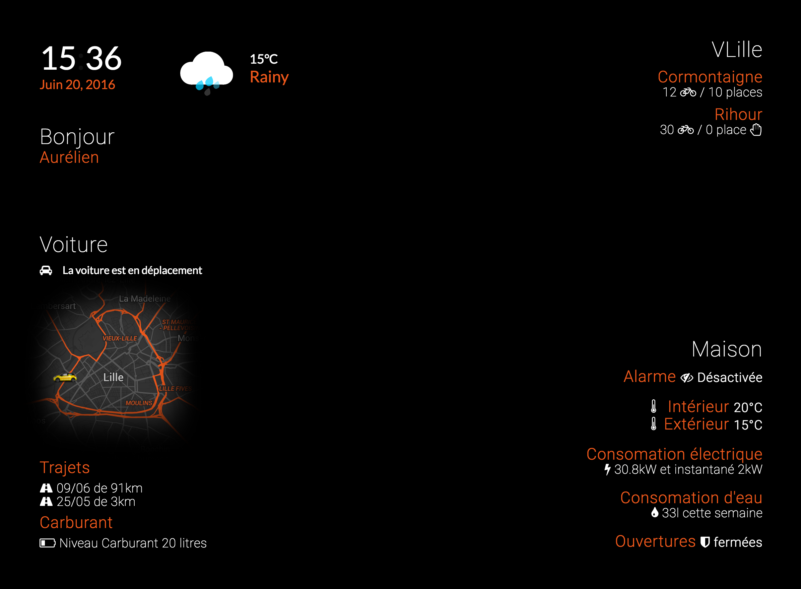

# The Mirror




## Web interface for connected mirror

### Electron app

```terminal
$ npm run electron
```

### Build & Watch

```json
"clean": "gulp clean",
"compile": "gulp compile",
"build": "gulp build",
"start": "concurrently --kill-others \"gulp watch\" \"lite-server\"",
"postinstall": "typings install"
```

```terminal
$ npm watch
$ npm build
```

### Widgets

- [x] Date time
- [x] Weather
- [x] Xee Car
- [x] Bike Vlille
- [x] Home
- [ ] ...

## Angular2

## Hardware

[- Raspberry Pi]:http://amzn.to/28Q1ztX
[- Motion Sensor]:http://amzn.to/28Q1zdA
[- Relay]:http://amzn.to/28SjqEU
- Monitor
[- Mirror]:http://amzn.to/28PN0bd

### Todo

- [ ] Weather Services Ng2
- [ ] Xee Services Ng2
- [ ] VLille Services Ng2
- [ ] Domoticz Services Ng2
- [ ] News widgets
- [ ] Hardware Motion et Relay sensor
