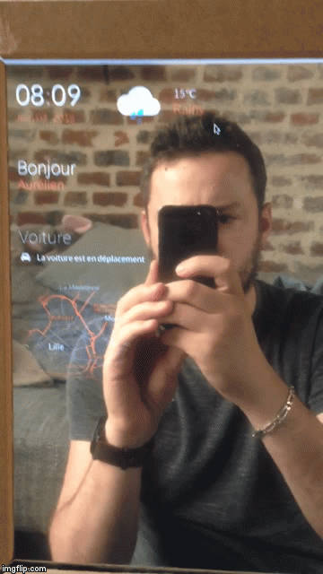

# Magic Mirror




## Web interface for connected screen

Web interface using Angular 2 and Angular CLI for displaying informations  

## Get the Code
```bash
git clone https://github.com/T3kstiil3/Magic-Mirror.git
cd Magic-Mirror
npm install
```

## Configuration

- Rename ApiService file (remove exemple.)
- Replace api key and url
  - [Maps]: https://console.developers.google.com/apis
  - [Openweathermap]: http://openweathermap.org/


## Launch the project
```bash
ng serve
```

## Creating a build
```bash
ng build
```

## Custom / Create ...
```bash
ng generate component test
```
Read Angular CLI documentation :)
[Angular CLI](https://github.com/angular/angular-cli)

### Base tag handling in index.html

When building you can modify base tag (`<base href="/">`) in your index.html with `--base-href your-url` option.

```bash
# Sets base tag href to /myUrl/ in your index.html
ng build --base-href /myUrl/
ng build --bh /myUrl/
```

### Running unit tests

```bash
ng test
```

Tests will execute after a build is executed via [Karma](http://karma-runner.github.io/0.13/index.html), and it will automatically watch your files for changes. You can run tests a single time via `--watch=false`.

### Running end-to-end tests

```bash
ng e2e
```

Before running the tests make sure you are serving the app via `ng serve`.

End-to-end tests are run via [Protractor](https://angular.github.io/protractor/).

<!--### Electron app
```terminal
$ npm run electron
```
-->

### Script Python

```python
import RPi.GPIO as GPIO         #import
import time

GPIO.setwarnings(False)
GPIO.setmode(GPIO.BOARD)
GPIO.setup(11, GPIO.IN)         #Read output from PIR motion sensor

screen = False                  #Screen ON on start by default
timeON = 300                    #Screen On 5 minutes

time.sleep(timeON)

def toggleScreen():
        GPIO.setup(7, GPIO.IN)
        time.sleep(0.5)
        GPIO.setup(7, GPIO.OUT)
        return;


while True:
        i=GPIO.input(11)
        if i==0:                 #When output from motion sensor is LOW
                print "No intruders",i
                time.sleep(1)
                if screen == True:
                        toggleScreen()
                        screen = False
        elif i==1:               #When output from motion sensor is HIGH
                print "Intruder detected",i
                toggleScreen()
                screen  = True
                time.sleep(timeON)
```
### Widgets

- [x] Date time
- [x] Weather
- [x] Xee Car
- [x] Bike Vlille
- [x] Home
- [ ] Twitter
- [ ] ...

## Angular2

## Hardware

- [Raspberry Pi]: http://amzn.to/28Q1ztX
- [Motion Sensor]: http://amzn.to/28Q1zdA
- [Relay]: http://amzn.to/28SjqEU
- Monitor
- [Mirror]: http://amzn.to/28PN0bd

### Todo
- [X] APP
- [X] Xee Services Ng2
- [X] VLille Services Ng2
- [ ] Weather night icon
- [ ] Domoticz Services Ng2
- [ ] News widgets
- [ ] Hardware Motion et Relay sensor
